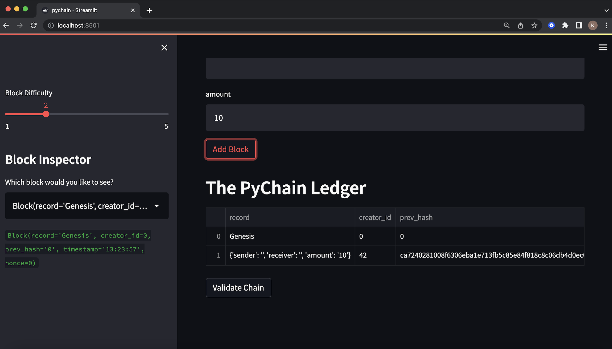
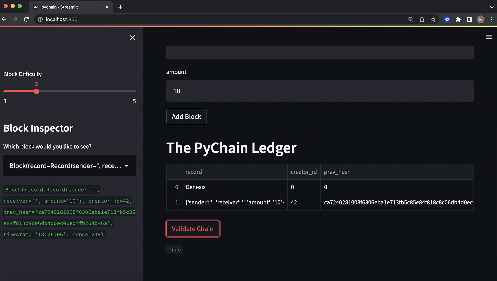

# PyChain-Ledger


# Overview

In this repository I used [Streamlit](https://streamlit.io/) for the web interface in order to build a blockchain-based ledger system.

This ledger should enable individuals to perform financial transactions, such as transferring money between senders and receivers, and to ensure the integrity of the data within it.

# Objectives

* Create a new data class named **`Record`**.
* Modify the existing **`Block`** data class to store **`Record`** data.
* Add Relevant User Inputs to the **`Streamlit`** interface.
* Test the PyChain Ledger by Storing **`Records`**.

## Installation

Before running the application, import the following libraries:

````
import streamlit as st
from dataclasses import dataclass
from typing import Any, List
import datetime as datetime
import pandas as pd
import hashlib
````


# Step 1:

# Step 2:

# Step 3:

# Step 4:

# Transaction Record Stored in PyChain 



# Blockchain Validation Process


